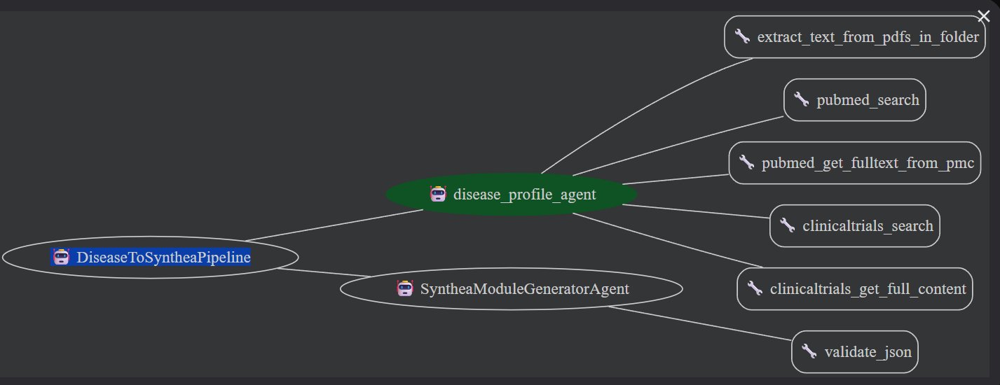

# 🚀 Disease-to-Synthea Agentic Pipeline
> Automatically generate **Synthea GMF JSON** modules from trusted biomedical evidence

This project implements an agentic workflow that:

🧠 Fetches real evidence from PubMed, PMC & ClinicalTrials.gov  
📄 Extracts additional facts from local PDFs  
🧬 Converts findings into a **Synthea Generic Module**  
👨‍⚕️ Generates synthetic patient data using Synthea

---
agent diagram



## 📑 Table of Contents
- [✨ Features](#-features)
- [🏗 Architecture](#-architecture)
- [📂 Project Structure](#-project-structure)
- [⚙️ Setup Guide](#️-setup-guide)
- [🧠 Agents & Behavior](#-agents--behavior)
- [🛠 Tools](#-tools)
- [🖥 CLI Usage](#-cli-usage)
- [🧬 Generate Patients with Synthea](#-generate-patients-with-synthea)
- [🏁 Quick Start Summary](#-quick-start-summary)
- [📌 Notes for Production](#-notes-for-production)

---

## ✨ Features

| Capability | Description |
|-----------|-------------|
| 📰 Automated Literature Extraction | PubMed + PMC full text |
| 🧪 Clinical Protocol Retrieval | ClinicalTrials.gov API v2 |
| 📄 PDF Mining | Local research PDF ingestion |
| 🔒 No Hallucination | Must rely only on fetched evidence |
| ✔ JSON Validated | Safe-mode JSON validation tool |
| ⚙ CLI Pipeline | One command runs entire workflow |

---

## 🏗 Architecture
```markdown
DiseaseToSyntheaPipeline
│
├── disease_profile_agent
│ ├── PubMed + PMC API tools
│ ├── ClinicalTrials.gov API tools
│ └── PDF extractor
│
└── synthea_module_generator_agent
├── Reads state["disease_profile"]
├── Generates safe GMF JSON
└── Validates via JSON tool
```

## 📂 Project Structure
```markdown
synthea/
├── agents/
│   ├── disease_profile.py
│   ├── synthea_module.py
│   └── pipeline_agent.py
├── tools/
│   ├── pubmed_api.py
│   ├── clinicaltrials.py
│   ├── pdf_extractor.py
│   └── json_validator.py
├── config/
│   └── settings.py
├── main.py
├── .env
└── requirements.txt
```


## ⚙️ Setup Guide

### 1️⃣ Create Virtual Environment
```bash
python -m venv .venv
source .venv/bin/activate      # macOS/Linux
.\.venv\Scripts\activate       # Windows

2️⃣ Install Requirements
pip install -r requirements.txt

3️⃣ Add Environment Variables (.env)
NCBI_API_KEY=YOUR_NCBI_API_KEY
GOOGLE_API_KEY=YOUR_GOOGLE_GENAI_API_KEY
⚠ Do NOT commit .env to version control
```
🧠 Agents & Behavior

🔹 Disease Profile Agent

* Prevalence and demographics
* Risk factors and etiology
* Symptoms and diagnosis
* Treatments and outcomes


🛑 No hallucinated medical facts
📌 Saves output to: session.state["disease_profile"]


🔹 Synthea Module Generator Agent

 Safe-mode JSON enforcement:
 * Allowed Synthea state types
 * direct_transition only
 * Placeholder codes if unavailable
 * Internal JSON validation loop

```markdown
Example placeholder:

"code": "999999",
"display": "Placeholder SNOMED Concept"

```

---
🛠 Tools
| Tool | Purpose |
|------|---------|
| 🔍 pubmed_search | Query research studies |
| 📚 pubmed_get_fulltext_from_pmc | Extract PMC full text |
| 🧪 clinicaltrials_search | Trial metadata extraction |
| 📝 clinicaltrials_get_full_content | Full protocol + eligibility |
| 📄 extract_text_from_pdfs_in_folder | Local PDF research ingestion |
| ✔ validate_json | Ensures correct JSON syntax |
---


### 🖥 CLI Usage

Run:
```bash
python main.py
Example:


you> Build a disease profile for "Malaria" and generate a Synthea module.
Output (example):

{"name":"Malaria_Module","gmf_version":2,"states":{ ... }}
Exit:


you> exit
🧬 Generate Patients with Synthea
Clone Synthea:


git clone https://github.com/synthetichealth/synthea.git
cd synthea
./gradlew build -x test
Copy module to:


src/main/resources/modules/my_custom_module.json
Run Synthea:


./gradlew run
Output stored in:


output/
 ├─ csv/
 ├─ fhir/
 └─ cda/
🏁 Quick Start Summary
Step	Command
Setup	pip install -r requirements.txt
Run pipeline	python main.py
Generate synthetic data	./gradlew run

🎉 Patient data → ready for analytics!

📌 Notes for Production
Use secure secret management (Vault, AWS Secrets Manager)

Enable DEBUG logs only when needed

Add new tools for more disease support

🤝 Contributing
Improvements welcome:

Better code mapping (SNOMED, RxNorm)

More clinical transitions

Validation enhancements

📜 License
MIT License — free for research & commercial use.

